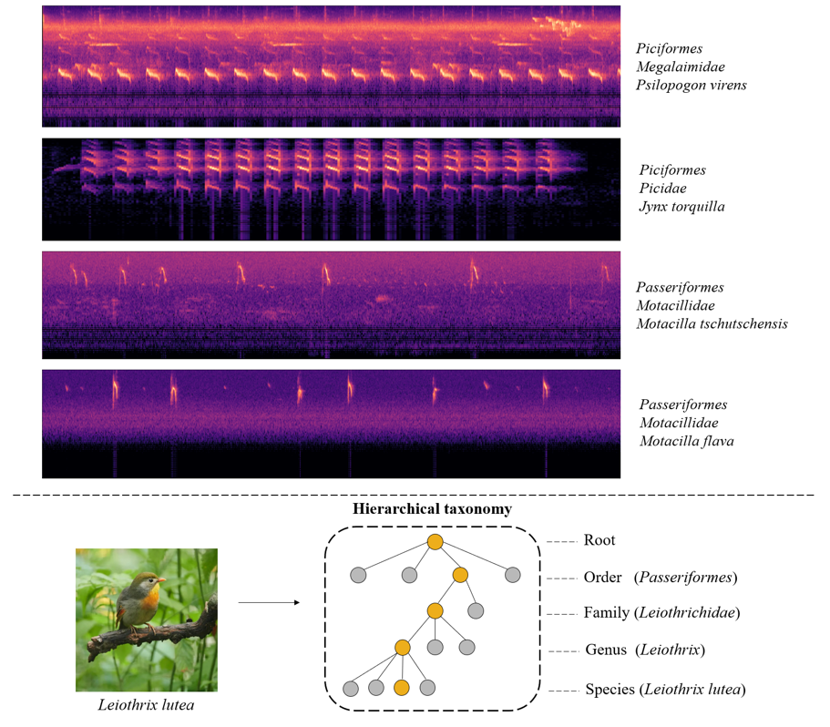
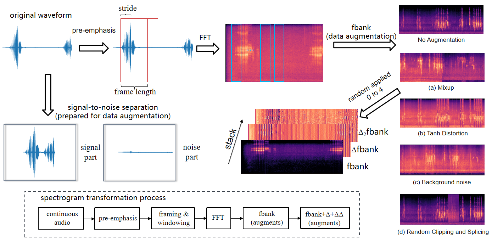
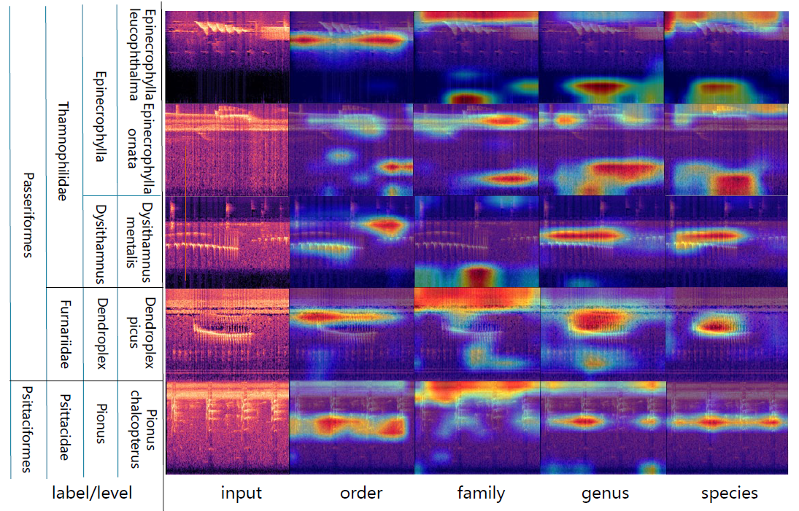

# Hierarchical-taxonomy-aware and attentional convolutional neural networks for acoustic identification of bird species: A genetics-informed approach
Hierarchical-taxonomy-aware and attentional convolutional neural networks for acoustic identification of bird species

# Authors
Qingyu Wang [1] & Yanzhi Song [1] & Yeqian Du [1] & Zhouwang Yang [1] & Peng Cui [2] & Binnan Luo [3]

[1] University of Science and Technology of China, School of Data Science, China

[2] Nanjing Institute of Environmental Sciences, China

[3] Jiangsu Tianning Ecological Group Co., China

# Abstract
The study of bird populations is crucial for biodiversity research and conservation. Deep artificial neural networks have revolutionized bird acoustic recognition, but most methods overlook hierarchical relationships among bird populations, resulting in the loss of ecological information. To address this concern, we propose the concept of Genetics-informed Neural Networks (GINN), a novel approach that incorporates hierarchical multilevel labels for each bird. This approach uses a hierarchical semantic embedding framework to capture feature information at different levels. Attention mechanisms are employed to extract and select common and distinguishing features, thereby improving classification accuracy. We also propose a path correction strategy to rectify inconsistent predictions. Experimental results on bird acoustic datasets demonstrate that GINN outperforms current methods, achieving classification accuracies of 90.450\%, 91.883\%, and 89.950\% on the Lishui-Zhejiang birdsdata (100 species), BirdCLEF2018-Small (150 species), and BirdCLEF2018-Large (500 species) datasets respectively, with the lowest hierarchical distance of a mistake across all datasets. This approach is applicable to any bird acoustic dataset, and the method presents significant advantages as the number of categories increases.

   

   
# Model architecture
## Audio preprocessing

   

Signal-noise separation + Spectrogram transformation + Data augmentation

## Genetics-informed Neural Network

   

# Results and findings

   

   

   

   

* The GINN model consistently outperformed all comparison methods on the BC-S
and BC-L datasets for each class hierarchy.

* The GINN model showed minimal parameter changes (+6.44M), highlighting its applicability.

* On the LS dataset, GINN exhibits superior generalization performance as the training set size decreases.

* The GINN model had the lowest HDM values on all datasets, implying that the application of hierarchical
  constraints can mitigate prediction errors, thereby enhancing the reliability of prediction.

## Grad-cam
Visualization of the activation achieved by four distinct network branches, each corresponding to a different hierarchy. 

   

# Get Started
## Open source data
[Our training data is open source and can be accessed here.](http://gofile.me/5Erwh/OlgtdIeul)
We provide the audio data (.wav) used to train and test our neural network classifier along with the corresponding metadata files (.xml).
You can download the zipped files or select specific portions of the data to create your own datasets.

### [BirdCLEF2018](https://www.imageclef.org/LifeCLEF2018)

The dataset is the official bird sound recognition competition dataset released by LifeCLEF for 2018. Sourced primarily from
the [Xeno-Canto Archive](xeno-canto.org), it contains songs of 1500 bird species from Central and South America, making it the
most comprehensive bird acoustics dataset in the literature. In total, the database containes 36,446 occurrences of bird songs recorded in files of various lengths.

### Zhejiang-lishui birdsdata

The dataset is a large collection of bird sounds gathered by the Lishui Ecological Environment Bureau from the natural environment of Lishui City, Zhejiang Province, China. 
It comprises live recordings of 597 distinct bird species spanning 20 orders and 68 families. In total, the database contains 123,109 occurrences of bird songs recorded in files of various lengths.

You can find the species list and their information in the ./Info folder.

## Code description
### Libraries
python==3.8.8

torch==1.9.1+cu111

torchvision==0.10.1+cu111

librosa==0.8.1

scikit-learn==1.0

numpy==1.22.3

matplotlib==3.7.1

kaldiio==2.17.2

audiomentations==0.27.0

pandas==1.5.3

openpyxl==3.0.9

tqdm==4.62.3

scikit-skimage==0.19.3

### Begin to train
1. Audio preprocessing: Execute the Python script audio_preprocessing.py located in the ./Codelist/ folder. This will generate processed audio files in three folders: ./SortedData/Song_22050, ./SortedData/BirdsOnly, and ./SortedData/NoiseOnly.

2. Partitioning the dataset: Utilize the Python script split_dataset.py in the ./Codelist/ folder to partition the dataset into training, validation, and testing sets. The result will be saved as ./SplitDatas/split_dataset1_with_hier.json.

3. Model training: Run the Python script train.py.

4. Model testing: Execute the Python script evaluation.py.

For more details, refer to the ./Codelist/ folder.

# Project
Our Biodiversity Intelligent Identification System is about to be launched.

http://180.101.130.43:10081/

# Contact
If you have any questions or want to use the code, please contact wangqingyu@mail.ustc.edu.cn.
